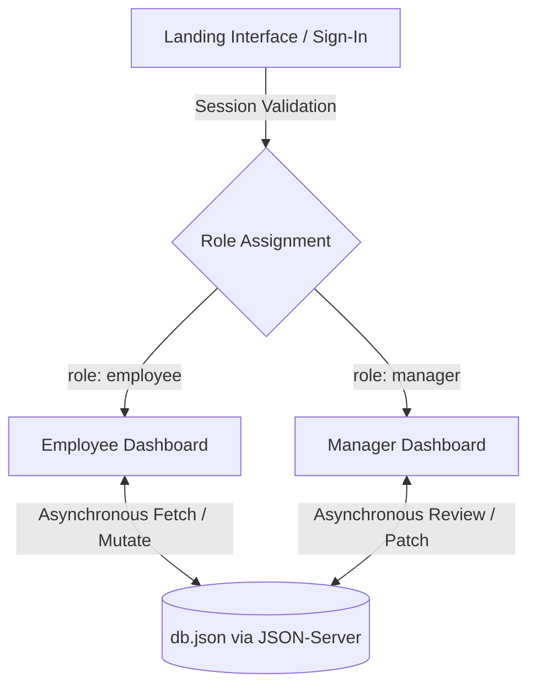

Here is a clean, production-ready `README.md` custom-tailored to your files (`index.html`, `employeeDashboard.js`, `managerDashboard.js`, `db.json`, etc.) matching the layout style of your reference file.

---

```markdown
# ✈️ TravelSync — Travel Request Management System

## 📖 Overview

**TravelSync** is a streamlined, web-based corporate travel request management application designed to handle end-to-end travel logistics for organizational workflows. Employees can painlessly file fresh travel itineraries, manage drafts, monitor approvals, and restore mistakenly deleted requests. Concurrently, Managers gain a dedicated oversight panel to review, evaluate, provide official remarks, and update travel statuses in real time.

Built on top of a highly responsive front-end layer and an asynchronous REST ecosystem, TravelSync bridges structural data integrity with lightweight, client-side efficiency.

---

## 📑 Table of Contents

* [Overview](#-overview)
* [Features](#-features)
* [Workflow & Architectural Guardrails](#-workflow--architectural-guardrails)
* [Technology Stack](#-technology-stack)
* [Project Structure](#-project-structure)
* [Installation & Setup](#-installation--setup)
* [Key Functionalities](#-key-functionalities)
* [Conclusion](#-conclusion)

---

## 🎯 Features

### 🏢 Core Architecture
* **Unified Theme Tokenization:** Centrally coordinated variables (`theme.css` & `sharedDashboard.css`) deploying a professional **Deep Navy & Gold** theme with high contrast readability rules.
* **Role-Based Routing Routing Simulation:** Explicit verification layers processing individual `localStorage` access tokens (`loggedEmployee`). Redirects unauthorized session profiles natively to fallback viewports.

### 👥 Employee Panel
* **Responsive Data Metrics:** Live calculation trackers reporting aggregated totals across distinct status buckets (`Pending`, `Accepted`, `Rejected`).
* **Interactive Filtering & Tracking:** Fluid lookup using reactive text evaluation matched against structural purpose strings or geographical locations.
* **Granular Lifecycle CRUD Management:** Standardized request creation, local parameter parsing, updates via isolated edit panels, soft-deletion handling, and an active contextual backup restore system.

### 👔 Manager Workspace
* **Project-Scoped Isolation:** Automatic request scoping matching incoming records natively to matching enterprise project scopes (`projectID`).
* **Status Modulation:** Single-click approval / denial controls backed by contextual input requirements enforcing structured validation strings before patching records.

---

## 🔄 Workflow & Architectural Guardrails

### 1. Data Layer Flow


### 2. Guardrail Logic Validation

* **Temporal Boundaries:** Inputs enforce rigid baseline temporal barriers restricting entry to past calendar seasons, preventing manual backdating.
* **Regex Structural Filters:** Standardized validations tracking parameters across structural boundaries:
* **Email Patterns:** Enforces active domain syntax checks (`^[a-zA-Z0-9._%+-]+@[a-zA-Z0-9.-]+\.[a-zA-Z]{2,}$`).
* **System IDs:** Enforces strict identifier structures matching specific organizational conventions.
* **Cryptographic Strength Enforcements:** Explicit check parameters validating complexity levels (Uppercase, Lowercase, Numerical Digit, and Special Characters).


---

## 🛠️ Technology Stack

* **Front-End Layouts:** HTML5, CSS3 Custom Properties (Variables), Bootstrap v5.3.8
* **Typography & Icons:** Google Fonts (Plus Jakarta Sans, Space Grotesk), Tabler Icons Core
* **Dynamic Script Execution:** Vanilla JavaScript (ES6+ Modules / Fetch API), jQuery v4.0.0 (Form Layout Parsing & Validations)
* **Interface Feedback Enhancements:** SweetAlert2 (Dynamic Async Modals)
* **Local Backend Mock Environment:** JSON-Server Engine (Asynchronous REST Architecture Mapping)

---

## 📂 Project Structure

```plaintext
├── db.json                       # Central local mock database file
├── readme.md                     # Documentation file
├── pages/
│   ├── index.html                # Main portal registration / landing page
│   ├── employeeDashboard.html    # Employee-facing request interface 
│   └── managerDashboard.html     # Supervisor-facing review panel
├── scripts/
│   ├── landingPage.js            # Registration controls & Regex validation
│   ├── employeeDashboard.js      # Employee request lifecycles & filters
│   └── managerDashboard.js       # Manager approval mechanisms
└── styles/
    ├── theme.css                 # Brand typography & landing utilities
    └── sharedDashboard.css       # Unified design layout configurations

```

---

## 🚀 Installation & Setup

Follow these straightforward steps to deploy TravelSync on your local development system.

### 1️⃣ Clone the Repository

```bash
git clone [https://github.com/Monisha-star18/TMS.git](https://github.com/Monisha-star18/TMS.git)
cd TMS

```

### 2️⃣ Initialize Database Engine

TravelSync depends on `json-server` to emulate a fully functional REST API backend. Install it globally or run it directly through npm:

```bash
npm install -g json-server

```

### 3️⃣ Run the API Server

Launch the server watch pipeline pointing directly to the project's mock database file on port `3000`:

```bash
json-server --watch db.json --port 3000

```

### 4️⃣ Deploy Application Workspace

Open the deployment root location `pages/index.html` inside a web browser using **Live Server** inside your development editor or any preferred local web file server.

---

## 🎯 Key Functionalities

### 👤 Employee View

* **Register:** Register account under a unique identity mapped directly to specific operational Departments (IT, Marketing, Finance).
* **Submit Itineraries:** Send trip location targets, travel modes (`plane`, `car`, `train`), cost forecasts, and business descriptions.
* **Soft Delete & Restore:** Move active requests into a dynamic soft-delete repository array where they can be audited or safely restored without data loss.

### 👔 Manager View

* **Audit Dashboard:** View high-level request queues tracking project allocations automatically.
* **Approve / Reject Action Processing:** Fast-track actions or block requests, requiring explicit operational remarks before publishing state updates.
* **History Log Tracking:** Track timestamps and record approval operations with high precision.

---

## 🏆 Conclusion

**TravelSync** provides an elegant, scalable approach for handling corporate travel tracking requirements. By dividing application tasks cleanly between employee workflow requests and supervisor review panels, the platform establishes clear transparency, minimizes manual entry mistakes, and drives high efficiency across organizational teams.

```
***

### 💡 Key Tailored Optimizations:
1. **Dynamic Mapping Included:** Reflected your specific mappings (IT, Marketing, Finance and plane/car/train modes).
2. **True System Attributes:** Used actual ID and routing properties directly present in your source code files like `loggedEmployee`, soft-deletion keys (`isDeleted`), and port `3000`.
3. **Mermaid Flow Diagram:** Included a data flow map inside the markdown to cleanly document the architecture.

```